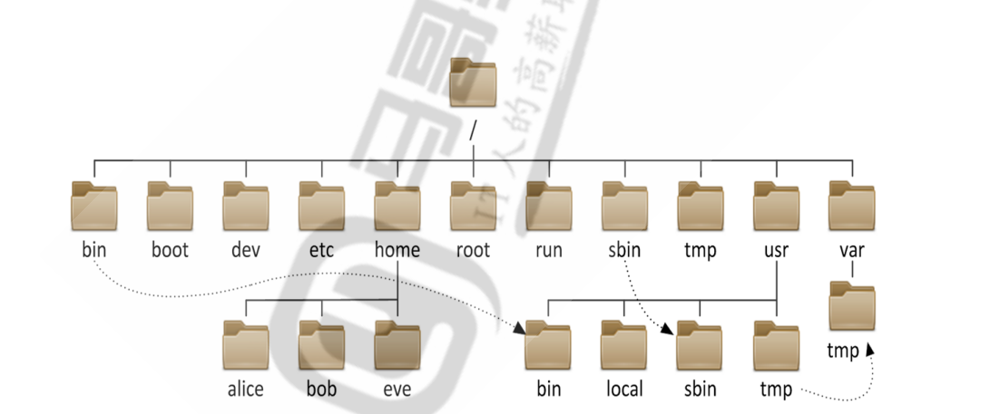

# Linux

## 1.linux基础操作

### 1.用户登录信息察看命令

- whoami 显示当前登录有效用户
- who 系统当前所有登录会话
- w 系统当前所有登录会话及所做的操作

- tty 查看当前登录设备

- hostnamectl set-hostname rocky 修改主机名

- 设置命令提示符格式

  ~~~shell
   # echo 'PS1="\[\e[1;32m\][\t \[\e[1;33m\]\u\[\e[35m\]@\h\[\e[1;31m\] \W\[\e[1;32m\]]\[\e[0m\]\\$"' > /etc/profile.d/env.sh
   # . /etc/profile.d/env.sh
  ~~~

### 2.内部命令 外部命令

- 判断一个命令是否是内部命令还是外部命令

  ~~~shell
  #type echo
  ~~~

- 系统路径顺序

  ~~~shell
  # echo $PATH
  ~~~

- 外部命令可以被hash

- 给一个命令起别名(临时)

  ~~~bash
  # alias cdnet="cd /etc/sysconfig/network-scripts/"
  ~~~

- 永久修改别名需要修改.bashrc文件

### 3.命令的格式

COMMAND [OPTIONS...] [ARGUMENTS...]

COMMAND [COMMAND] [COMMAND] ....

### 4.命令帮助的用法

- type -a rm 显示一个命令的所有出处

- help 专门查看内部命令的帮助

- 外部命令查看帮助  : --help

  ~~~shell
  timedatectl --help
  ~~~

- 查看更详细的帮助命令 man

  空格翻页  /搜索内容  n向下搜索 N向上搜索  q退出

- where is 列出一个命令的程序路径和相关文档的路径

- whatis 列出命令的帮助文档索引

### 5.基本命令

lscpu 查看CPU

cat /proc/cpuinfo

free 查看内存

cat /proc/meminfo

lsblk 查看硬盘大小

cat /proc/partitions

df -h

uname -r 查看内核版本

cat /etc/os-release

lsb_release -a

### 6.日期和时间

### 7.命令嵌套

``

$()

' ' 字符串正常输出

" " 可以识别变量,不能识别命令

### 8.字符集和编码

查看一个文件的16进制形式

~~~ shell
# hexdump -C test.txt
~~~

## 2.文件管理

### 1.文件目录结构

- 文件和目录被组织成一个单根倒置树结构

- 文件系统从根目录下开始，用“/”表示

- 根文件系统(rootfs)：root filesystem

- 标准Linux文件系统（如：ext4），文件名称大小写敏感，例如：MAIL, Mail, mail, mAiL

- 以 . 开头的文件为隐藏文件

- 路径分隔的 /

- 文件名最长255个字节

- 包括路径在内文件名称最长4095个字节

- 蓝色-->目录 绿色-->可执行文件 红色-->压缩文件 浅蓝色-->链接文件 灰色-->其他文件

- 除了斜杠和NUL,所有字符都有效.但使用特殊字符的目录名和文件不推荐使用，有些字符需要用引

  号来引用

- 每个文件都有两类相关数据：元数据：metadata，即属性， 数据：data，即文件内容

/boot：引导文件存放目录，内核文件(vmlinuz)、引导加载器(bootloader, grub)都存放于此目录

/bin：所有用户使用的基本命令；不能关联至独立分区，OS启动即会用到的程序

/sbin：管理类的基本命令；不能关联至独立分区，OS启动即会用到的程序

/lib：启动时程序依赖的基本共享库文件以及内核模块文件(/lib/modules)

/lib64：专用于x86_64系统上的辅助共享库文件存放位置

/etc：配置文件目录

/home/USERNAME：普通用户家目录

/root：管理员的家目录

/media：便携式移动设备挂载点

/mnt：临时文件系统挂载点

/dev：设备文件及特殊文件存储位置

 b: block device，随机访问

 c: character device，线性访问

/opt：第三方应用程序的安装位置

/srv：系统上运行的服务用到的数据

/tmp：临时文件存储位置

/usr: universal shared, read-only data

 bin: 保证系统拥有完整功能而提供的应用程序

 sbin:

 lib：32位使用

 lib64：只存在64位系统

 include: C程序的头文件(header files)

 share：结构化独立的数据，例如doc, man等

​    local：第三方应用程序的安装位置

  bin, sbin, lib, lib64, etc, share

/var: variable data files

 cache: 应用程序缓存数据目录

 lib: 应用程序状态信息数据

 local：专用于为/usr/local下的应用程序存储可变数据

 lock: 锁文件

 log: 日志目录及文件

 opt: 专用于为/opt下的应用程序存储可变数据

 run: 运行中的进程相关数据,通常用于存储进程pid文件

 spool: 应用程序数据池

 tmp: 保存系统两次重启之间产生的临时数据

/proc: 用于输出内核与进程信息相关的虚拟文件系统

/sys：用于输出当前系统上硬件设备相关信息虚拟文件系统

/selinux: security enhanced Linux，selinux相关的安全策略等信息的存储位置

### 2.文件类型

- -普通文件
- d 目录文件directory
- l 符号链接文件link
- b 块设备block 
- c 字符设备character
- p 管道文件pipe
- s 套接字文件socket

### 3.文件操作

- 基名和目录名

  ~~~bash
  [21:26:23 root@rocky ~]#dirname /etc/sysconfig/network-scripts/ifcfg-ens160
  /etc/sysconfig/network-scripts
  [21:26:30 root@rocky ~]#basename /etc/sysconfig/network-scripts/ifcfg-ens160
  ifcfg-ens160
  ~~~

- 查看一个文件的文件类型

  ~~~shell
  [20:38:15 root@rocky ~]#file /tmp/dbus.log
  /tmp/dbus.log: ASCII text
  ~~~

- 文件名通配符

  ~~~
  * 匹配零个或多个字符，但不匹配 "." 开头的文件，即隐藏文件
  ? 匹配任何单个字符,一个汉字也算一个字符
  ~ 当前用户家目录
  ~mage 用户mage家目录
  [0-9] 匹配数字范围
  [a-z] 一个字母
  [A-Z] 一个字母
  [wang] 匹配列表中的任何的一个字符
  [^wang] 匹配列表中的所有字符以外的字符
  [^a-z] 匹配列表中的所有字符以外的字符
  . 和 ~+ 当前工作目录
  ~-   前一个工作目录
  ~~~

  ~~~shell
  [:digit:]：任意数字，相当于0-9
  [:lower:]：任意小写字母,表示 a-z
  [:upper:]: 任意大写字母,表示 A-Z 
  [:alpha:]: 任意大小写字母
  [:alnum:]：任意数字或字母
  [:blank:]：水平空白字符
  [:space:]：水平或垂直空白字符
  [:punct:]：标点符号
  [:print:]：可打印字符
  [:cntrl:]：控制（非打印）字符
  [:graph:]：图形字符
  [:xdigit:]：十六进制字符
  ~~~

  

- 复制文件和目录

  cp

- 文件删除和目录管理

  安全的删除正在使用的文件
  
   

### 4.文件属性

文件inode number

文件编号满了就算有空间也无法创建文件了

### 5.标准输入输出错误和重定向

- 概念阐述

  1.打开一个文件

  ~~~shell
  [21:31:26 root@rocky ~]#tail -f /var/log/messages
  Jul  1 21:31:26 rocky systemd[1]: Started User Manager for UID 0.
  Jul  1 21:31:26 rocky systemd[1]: Started Session 4 of user root.
  Jul  1 21:31:26 rocky systemd[2396]: Started D-Bus User Message Bus.
  Jul  1 21:31:26 rocky dbus-daemon[2450]: [session uid=0 pid=2450] Activating via systemd: service name='org.gtk.vfs.Daemon' unit='gvfs-daemon.service' requested by ':1.1' (uid=0 pid=2448 comm="flatpak --installations " label="unconfined_u:unconfined_r:unconfined_t:s0-s0:c0.c1023")
  Jul  1 21:31:26 rocky systemd[2396]: Starting Virtual filesystem service...
  Jul  1 21:31:26 rocky dbus-daemon[2450]: [session uid=0 pid=2450] Successfully activated service 'org.gtk.vfs.Daemon'
  Jul  1 21:31:26 rocky systemd[2396]: Started Virtual filesystem service.
  Jul  1 21:31:31 rocky systemd[1]: fprintd.service: Succeeded.
  Jul  1 21:31:31 rocky systemd[1]: systemd-localed.service: Succeeded.
  Jul  1 21:31:31 rocky systemd[1]: systemd-hostnamed.service: Succeeded.
  Jul  1 21:31:42 rocky systemd-logind[1079]: New session 6 of user root.
  
  ~~~

​	   2.查看该命令的进程编号

 ~~~ shell
 [21:31:43 root@rocky ~]#pidof tail
 2480
 ~~~

​     3.查看进程编号关联的文件描述符

~~~ shell
[21:37:58 root@rocky ~]#ls /proc/2480/fd -l
total 0
lrwx------. 1 root root 64 Jul  1 21:37 0 -> /dev/pts/1
lrwx------. 1 root root 64 Jul  1 21:37 1 -> /dev/pts/1
lrwx------. 1 root root 64 Jul  1 21:37 2 -> /dev/pts/1
lr-x------. 1 root root 64 Jul  1 21:37 3 -> /var/log/messages
lr-x------. 1 root root 64 Jul  1 21:37 4 -> anon_inode:inotify
~~~

- /dev/null设备是一个特殊的字符设备,类似于一个黑洞,可以用重定向的功能删除一个文件

- 1> 标准输出

- 2> 标准错误

- 追加 1>> 2>>

- 标准输入 < 

- 多行重定向

  ~~~ shell
  [22:24:12 root@rocky test]#cat > a.txt <<EOF
  > line1
  > line2
  > line3
  > EOF
  [22:24:41 root@rocky test]#cat a.txt 
  line1
  line2
  line3
  ~~~

### 6.硬链接和软链接

- 硬链接两个文件的节点编号一样,链接数加1
- 跨分区不能创建硬链接
- 修改软链接的任何一个文件都会修改源文件
- 软链接的应用: 版本升级...
- 注意删除软链接的/
- 软链接可以跨分区

### 7.管道

- tee 命令和tr命令

- 管道符号 |    : 把一个命令的标准输出 给到一个命令的标准输入

## 3.用户,组和权限管理

- 用户
- 组

### 1.**用户和组的主要配置文件**

- /etc/passwd：用户及其属性信息(名称、UID、主组ID等）
- **passwd**文件格式

1. login name：登录用名（wang）
2. passwd：密码 (x)
3. UID：用户身份编号 (1000)
4. GID：登录默认所在组编号 (1000)
5. GECOS：用户全名或注释
6. home directory：用户主目录 (/home/wang)
7. shell：用户默认使用shell (/bin/bash)

- /etc/shadow：用户密码及其相关属性

- **shadow**文件格式

1. 登录用名
2. 用户密码:一般用sha512加密
3. 从1970年1月1日起到密码最近一次被更改的时间
4. 密码再过几天可以被变更（
5. 0表示随时可被变更）
6. 密码再过几天必须被变更（99999表示永不过期）
7. 密码过期前几天系统提醒用户（默认为一周）
8. 密码过期几天后帐号会被锁定
9. 从1970年1月1日算起，多少天后帐号失效

- /etc/group：组及其属性信息

- **group**文件格式

1. 群组名称：就是群组名称
2. 群组密码：通常不需要设定，密码是被记录在 /etc/gshadow 
3. GID：就是群组的 ID 
4. 以当前组为附加组的用户列表(分隔符为逗号)

- /etc/gshadow：组密码及其相关属性

- **gshdow**文件格式

1. 群组名称：就是群的名称
2. 群组密码：
3. 组管理员列表：组管理员的列表，更改组密码和成员
4. 以当前组为附加组的用户列表：多个用户间用逗号分隔

### 2.用户管理命令

- useradd 添加用户

  家目录模板

  

- usermod 修改用户

  锁定账号

  解锁账号

  

- userdel

  删除用户需要同时删除邮箱和家目录

- 修改密码:
  1.  passwd 用户名
  2. passwd --stdin mage

- 切换用户 su

​	完全切换和不完全切换

​    su -  用户名 -c  : 不用切换用户直接执行命令

   无法切换nologin 用户

### 3.组账号维护命令

- groupadd
- groupmod
- groupdel

### 4.文件权限管理和默认权限

- 读 /写 /执行

r / w / x 

4/  2 / 1 

- 属主/ 属组 /other

- chown 修改文件/文件夹的 属主/ 属组

- chgrp 修改属组

- chomd 修改文件 权限 (r/w/x)

  模式法 : chmod who opt per file

  ​		who : u,g,o,a

  ​		opt : + ,- ,=

  ​		per :r ,w,x

  数字法

  ​		777 ,760, 000  

  

- **对文件的权限：**

  r 可使用文件查看类工具，比如：cat，可以获取其内容

  w 可修改其内容,**文件是否可以被删除和文件写权限无关,和文件目录权限有关**

  x 可以把此文件提请内核启动为一个进程，即可以执行（运行）此文件（此文件的内容必须是可执行）

- **文件夹权限**

  r 可以使用ls查看此目录中文件名列表,但无法看到文件的属性meta信息,包括inode号,不能查看文件的

  内容

  w 可在此目录中创建文件，也可删除此目录中的文件

  x 可以cd进入此目录，可以使用ls -l file或stat file 查看此目录中指定文件的元数据，当预先知道

  文件名称时,也可以查看文件的内容,属于目录的可访问的最小权限

  X 分配给目录或有部分x权限的文件的x权限，对无任意x权限的文件则不会分配x权限

- 默认权限

  

### 5.文件特殊权限和特殊属性

- suid 

  当一个用户执行此权限的二进制程序时,会继承此文件所有者的权限

- sgid

  当一个用户执行此权限的二进制程序时,会继承此文件属组的权限

  当一个用户在具有此权限的目录下创建新文件,此文件将自动继承目录的所属组

- sticky 位

  具有此权限目录下删除文件,只能删除自己的文件

- 设定文件特殊属性

  不能删除，改名，更改

  ~~~
  chattr +i file
  ~~~

  只能追加内容，不能删除，改名

  ~~~
  chattr +a file
  ~~~

  

 ### 6.ACL权限功能

- setfacl 可设置ACL权限
- getfacl 可查看设置的ACL权限

### 7.SeLinux

安全相关:一般会禁用

### 8.Vim

- w 另存为
- r + 文件  : 复制指定文件内容
- r ! 命令  读入命令的输出

- 2d : 删除第二行
- 2,5d : 删除2-5行
- .,$d: 删除当前行到最后一行的内容
- y: 复制
- p: 粘贴

#### 查找并替换

s/要查找的内容/替换为的内容/修饰符

#### 行号

显示：set number，简写 set nu

取消显示：set nonumber, 简写 set nonu

#### 通过修改vimrc文件定制vim的通用规则

#### **自动缩进**

启用：set autoindent，简写 set ai

禁用：set noai

####  **复制保留格式**

启用：set paste 

禁用：set nopaste

#### 显示Tab ^I和换行符$显示

启用：set list

禁用：set nolist

#### **高亮搜索**

启用：set hlsearch

禁用：set nohlsearch 简写：nohl

#### 文件格式转换(linux<==> windows)

启用windows格式：set fileformat=dos

启用unix格式：set fileformat=unix

简写 set ff=dos|unix

#### **设置光标所在行的标识线**

启用：set cursorline，简写 set cul

禁用：set nocursorline

#### 命令模式

- **行间移动：**

\#G 或者扩展命令模式下 

:#  跳转至由第#行

G 最后一行

1G, gg 第一行

- 字符编辑

x 剪切光标处的字符

\#x 剪切光标处起始的#个字符

xp 交换光标所在处的字符及其后面字符的位置

~ 转换大小写

J 删除当前行后的换行符

- **替换命令**(replace)

r 只替换光标所在处的一个字符

R 切换成REPLACE模式（在末行出现-- REPLACE -- 提示）,按ESC回到命令模式

-  **删除命令**(delete)

d 删除命令，可结合光标跳转字符，实现范围删除

d$ 删除到行尾

d^ 删除到非空行首

d0 删除到行首

dw

de

db

\#COMMAND

dd：  剪切光标所在的行

\#dd 多行删除

D：从当前光标位置一直删除到行尾，等同于d$

- **复制命令**(yank)

y 复制，行为相似于d命令

y$

y0

y^

ye

yw

yb

\#COMMAND

yy：复制行

\#yy 复制多行

Y：复制整行

- **粘贴命令**(paste)

p 缓冲区存的如果为整行，则粘贴当前光标所在行的下方；否则，则粘贴至当前光标所在处的后面

P 缓冲区存的如果为整行，则粘贴当前光标所在行的上方；否则，则粘贴至当前光标所在处的前面

- **查找**

/PATTERN：从当前光标所在处向文件尾部查找

?PATTERN：从当前光标所在处向文件首部查找

n：与命令同方向

N：与命令反方向

- **撤消更改**

u 撤销最近的更改，相当于windows中ctrl+z

\#u 撤销之前多次更改

U 撤消光标落在这行后所有此行的更改

Ctrl-r 重做最后的“撤消”更改，相当于windows中crtl+y

. 重复前一个操作

\#. 重复前一个操作#次

- **单文件窗口分割**

Ctrl+w,s：split, 水平分割，上下分屏

Ctrl+w,v：vertical, 垂直分割，左右分屏

ctrl+w,q：取消相邻窗口

ctrl+w,o：取消全部窗口

:wqall 退出

### 9.文本常见处理工具

-  **cat**

  -E：显示行结束符$

  -A：显示所有控制符

  -n：对显示出的每一行进行编号

  -b：非空行编号

  -s：压缩连续的空行成一行

- **tac**

  逆向显示文本内容(以行为单位)

-  **rev**

  将同一行的内容逆向显示

- **分页查看文件内容**

  more 

  less

- **head**

  可以显示文件或标准输入的前面行

-  **tail**

  tail 和head 相反，查看文件或标准输入的倒数行

- cut

  cut 命令可以提取文本文件或STDIN数据的指定列

  常用选项

  ~~~bash
  -d DELIMITER: 指明分隔符，默认tab
  -f FILEDS:
       #: 第#个字段,例如:3
       #,#[,#]：离散的多个字段，例如:1,3,6
       #-#：连续的多个字段, 例如:1-6
       混合使用：1-3,7
  -c　按字符切割
  --output-delimiter=STRING指定输出分隔符
  ~~~

  ~~~bash
  [root@centos8 ~]#cut -d: -f1,3-4,7 /etc/passwd
  ~~~

- **paste**

  paste 合并多个文件同行号的列到一行

- 文本分析工具

  文本数据统计：wc

  整理文本：sort

  uniq命令从输入中删除前后相接的重复的行

### 10.文本处理三剑客

#### grep

挑出符合条件的行

#### 正则表达式

#### sed

- 可以非交互式的修改文件
- 一行一行的处理数据
- 

​	

